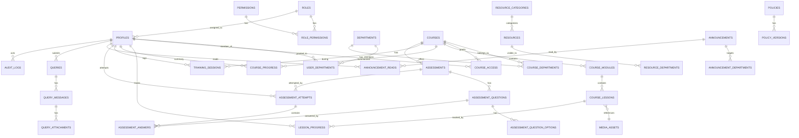

# SYSTEM_PLAN.md — Internal Training Platform

Status: **Draft for review — no implementation started.**
Owner: Architecture (this document is the source of truth until superseded).

---

## 1. Executive Summary

The Internal Training Platform is a corporate LMS with two portals — an **Admin Portal** and a **User/Trainer Portal** — built on React/Vite/TypeScript on the frontend, Node.js/Express/TypeScript + Prisma on the backend, and Supabase (PostgreSQL, Auth, Storage) as the managed data/identity/file layer.

The system is organized around four architectural pillars that every other decision derives from:

1. **Departments are data, not code.** All department-scoped behavior (who sees what course/resource/announcement) is expressed through relational join tables, never through hard-coded department names, enum values, or per-department tables.
2. **Authorization lives on the server.** The Express API is the single source of truth for "can this user do this." React hides UI for UX polish only. PostgreSQL Row Level Security (RLS) and Supabase Storage policies act as a second, independent enforcement layer (defense-in-depth), not as the primary gate.
3. **Progress and completion are derived, not entered.** Course/theoretical/practical progress and "completed course" status are computed from lesson-level and assessment-level facts (`lesson_progress`, `assessment_attempts`), never stored as an arbitrary admin-typed percentage.
4. **Files are private by default.** All uploaded media lives in private Supabase Storage buckets. The API mediates every access with an authorization check followed by a short-lived signed URL. No bucket is public; no client ever holds the service-role key.

This document defines the data model, authorization model, API surface, folder structure, and phased delivery plan needed to build the platform without rework as departments, roles, and course content scale.

---

## 2. Goals

- A single codebase serving two portals with shared authentication and a shared data model.
- Fully dynamic departments: creatable/editable/deactivatable by an Admin with zero code changes.
- Enforced, server-side, multi-layered authorization for every course, resource, policy, and file.
- A reusable assessment engine (not a single hard-coded quiz type).
- Accurate, derived training-hour and progress tracking suitable for compliance/reporting.
- Private, access-controlled media delivery (documents and video) via Supabase Storage.
- A professional, consistent, responsive UI/UX system usable on desktop, tablet, and mobile.
- An architecture a small team can realistically build and maintain within a short timeline.
- Clear extension points for roles, certificates, notifications, live sessions, and reporting — added later without restructuring.

## 3. Non-Goals (for this phase)

- Deployment/infrastructure design (CI/CD, hosting topology, CDN selection) — noted only where it affects application architecture (e.g., signed URLs).
- Native mobile apps (responsive web only).
- Live/synchronous training delivery (video conferencing) — future extensibility only.
- Payment/billing, multi-tenant (multi-company) support.
- Full internationalization — the schema should not block it, but translation infrastructure is out of scope.
- Guaranteeing that video/documents cannot be copied or screen-recorded — this is explicitly **not achievable** in a browser and is discussed in §16.

---

## 4. Functional Requirements

Summarized from the brief; each is mapped to an owning module and, at the end of this document, to the architectural component that satisfies it (§40, Requirement Coverage).

**User Portal:** Dashboard, Course Catalogue, Completed Courses, Assessments, Resources, Announcements, Query/Support, Policies & Procedures.

**Admin Portal:** Users, Departments, Courses/Modules/Lessons, Course Access, Progress (view/oversight), Assessments, Resources, Announcements, Queries, Policies & Versions, Media/Files, System Configuration.

---

## 5. User Roles

Minimum roles: `ADMIN`, `TRAINER_USER` (the general trainee/learner role — "Trainer/Employee" per the brief; the person being trained, not to be confused with a future "instructor" role).

**Role extensibility design:** roles are **not** a hard-coded TypeScript union used for authorization decisions. They are:

- A `roles` table (`code`, `name`, `description`, `is_system`) — new rows can be added by a migration without touching authorization logic.
- A `permissions` table (`code`, `description`) enumerating fine-grained capabilities (e.g. `course.create`, `announcement.publish`, `policy.version.activate`, `user.manage`).
- A `role_permissions` join table mapping roles → permissions.

The Express authorization middleware checks **permissions**, not role names (`requirePermission('course.create')`, not `requireRole('ADMIN')`). `ADMIN` is simply the role that, by seed data, holds all permissions. This is what lets a future `TRAINER` (instructor), `MANAGER`, or `DEPARTMENT_LEAD` role be introduced by inserting rows, not by rewriting `if (role === 'ADMIN')` checks scattered through the codebase.

Each `profile` has exactly one `role_id` (a person's primary capability set). If true multi-role-per-user is needed later, `user_roles` can replace the single FK without changing the permission-check call sites, since callers already ask "does this user have permission X," not "what is this user's role."

---

## 6. Department & Access Model

- `departments` is a plain admin-managed table: `id`, `name`, `slug`, `description`, `is_active`, timestamps. No enum, no code reference to specific department names anywhere in the backend or frontend.
- Users belong to **one or more** departments via `user_departments` (many-to-many), matching the brief's explicit future-proofing requirement.
- Courses belong to **one or more** departments via `course_departments` (many-to-many) — not one department, and never a per-department course table. A course created for "Sales" and later shared with "Recruitment" is a matter of inserting one row, not migrating data.
- Resources and Announcements follow the same pattern (`resource_departments`, `announcement_departments`). An empty department set for a resource/announcement means **visible to all departments** (global content) — this avoids needing a separate "is_global" flag that could drift out of sync with department rows.
- **Access resolution rule** (implemented once, in one service function, reused everywhere — `src/modules/authorization/access.service.ts`):

  A user can access a course if **either**:
  1. The user has an active membership in at least one department the course belongs to, **or**
  2. There exists an active row in `course_access` explicitly granting that user access (department-independent override, e.g. a Recruitment employee sitting in on a Sales course).

  Revocation is a soft state (`revoked_at`, `revoked_by` populated) — access rows are never deleted, preserving history for audit.

This single resolution function is called from the API layer for every course-scoped read/write, and its SQL shape is mirrored in the RLS policy for the same tables (see §12), so both layers agree by construction rather than by convention.

---

## 7. Overall Architecture

```
┌────────────────────┐        HTTPS/JSON        ┌──────────────────────────┐
│  React SPA (Vite)   │  ───────────────────────▶ │  Express API (/api/v1)   │
│  Admin + User portal│ ◀───────────────────────  │  Node.js + TypeScript    │
└─────────┬───────────┘                            └───────────┬──────────────┘
          │  Supabase Auth (JWT, client SDK)                   │  Prisma (service DB role)
          │  — sign in/out/refresh only                        │  Supabase Admin SDK (service role)
          ▼                                                     ▼
┌─────────────────────┐                            ┌──────────────────────────┐
│  Supabase Auth       │ ── issues JWT ───────────▶ │  PostgreSQL (Supabase)   │
│  (email/password)    │                            │  Prisma schema + RLS     │
└─────────────────────┘                            └───────────┬──────────────┘
                                                                 │
                                                     ┌───────────▼──────────────┐
                                                     │  Supabase Storage         │
                                                     │  private buckets          │
                                                     │  (accessed only via API)  │
                                                     └───────────────────────────┘
```

Key boundary: **the React app never talks to PostgreSQL or Storage directly for business data.** It uses the Supabase client SDK for exactly one purpose — authentication (sign-in, sign-out, session/JWT refresh) — using the public anon key, which is safe to ship to the browser. Every business read/write (courses, progress, assessments, files) goes through the Express API, which validates the Supabase JWT, then talks to PostgreSQL via Prisma and to Storage via the Supabase service-role client. The service-role key exists only in the Node process's environment.

---

## 8. Technology Stack

| Layer              | Choice                                  | Notes                                                  |
| ------------------ | --------------------------------------- | ------------------------------------------------------ |
| Frontend framework | React 18 + Vite + TypeScript            | SPA, strict TS                                         |
| Routing            | React Router v6                         | Nested layouts per portal                              |
| Server state       | TanStack Query                          | Caching, retries, invalidation                         |
| Forms              | React Hook Form + Zod resolvers         | Shared Zod schemas with backend where practical        |
| Styling/UI         | Tailwind CSS + shadcn/ui + Lucide icons | See §34 for design system                              |
| Backend framework  | Node.js + Express + TypeScript          | Modular by feature                                     |
| Validation         | Zod                                     | Request DTO validation at the edge                     |
| ORM                | Prisma                                  | Migrations + typed queries against Supabase PostgreSQL |
| Database           | Supabase PostgreSQL                     | RLS enabled, defense-in-depth                          |
| Auth               | Supabase Auth                           | Email/password, JWT-based                              |
| File storage       | Supabase Storage                        | Private buckets, signed URLs only                      |
| Package manager    | pnpm (workspaces)                       | `apps/web`, `apps/api`, `packages/shared`              |

---

## 9. Authentication Architecture

**Provider:** Supabase Auth (email + password). No custom password hashing/storage code is written — Supabase owns credential storage.

**Admin-created users:** The brief requires admins to create users from just name/phone/email (no password entry by the admin). Flow:

1. Admin submits `{ full_name, email, phone, department_ids, role_id, employee_id }` to `POST /api/v1/admin/users`.
2. API validates input, uses the **Supabase Admin SDK (service role, server-side only)** to create the `auth.users` record via `admin.inviteUserByEmail` (or `admin.createUser` + `admin.generateLink` for an invite/reset link), and creates the corresponding `profiles` row in the same transaction-equivalent (profile creation is retried/reconciled if the auth call succeeds but the DB write fails — see §31).
3. The user receives an email to set their own password and activate their account. The application never sees or stores a plaintext password.

**Session handling (frontend):**

- Supabase JS client manages the session (access token + refresh token) via its own storage adapter.
- **Token storage strategy:** the Supabase client's default is `localStorage`. For this platform we configure it to store the session in memory + a secure, `httpOnly`-inaccessible refresh flow is _not_ achievable purely client-side with Supabase's default flow, so we accept `localStorage` for the access/refresh token pair (standard Supabase SPA pattern) but mitigate XSS risk primarily through strict output encoding/CSP (§11) rather than relying on token storage alone — storing tokens in a way JS can't read at all would require a custom backend-for-frontend session proxy, which is out of scope for this phase and noted as a future hardening option (§29).
- The access token (JWT) is attached as `Authorization: Bearer <token>` on every API request.

**Backend verification:**

- Express middleware (`modules/auth/auth.middleware.ts`) verifies the JWT signature against Supabase's JWT secret (or JWKS for asymmetric projects), checks expiry, and extracts `sub` (the Supabase `auth.users.id`).
- The middleware then loads the corresponding `profiles` row (cached briefly per-request) to attach `req.user = { id, role, permissions, departmentIds, status }` for downstream authorization checks.
- A profile with `status != ACTIVE` is rejected with 403 even if the JWT is valid (handles disabled/suspended accounts immediately, without waiting for token expiry).

**Failure handling:** invalid/expired JWT → 401 with a generic message (no distinction between "token expired" vs "malformed" in the response body, to avoid aiding token-forging attempts); logged server-side with reason.

---

## 10. Authorization Architecture

Three concentric layers, in order of trust:

1. **Express API (primary, authoritative).** Every route handler is wrapped by:
   - `requireAuth` — valid session + active profile.
   - `requirePermission('<code>')` — permission-table lookup (§5), not role-name string comparison.
   - Resource-scoped checks where relevant — e.g. `requireCourseAccess(courseId)` calls the single access-resolution function from §6; `requireOwnQueryOrSupportRole` for the query system.
2. **PostgreSQL RLS (defense-in-depth).** Enabled on every table containing user-scoped or department-scoped data. Policies mirror the API's access rules (same department/course-access logic expressed in SQL — see §12). This protects against a bug in application code, a future direct-DB integration, or a compromised API key with narrower-than-service-role privileges.
3. **Supabase Storage policies (file-layer defense-in-depth).** Buckets are fully private; the API is the only caller with service-role Storage access. RLS-style Storage policies are still configured to deny all direct client access, so a leaked anon key cannot list or read bucket contents.

**Frontend authorization** (route guards, hidden buttons) exists **only** for UX — e.g., not rendering "Delete Course" for a user without `course.delete`. It is explicitly documented in code comments as non-authoritative, and every such action is re-checked server-side regardless of what the UI allowed the user to attempt.

---

## 11. Security Architecture

| Concern                 | Control                                                                                                                                                                                                                              |
| ----------------------- | ------------------------------------------------------------------------------------------------------------------------------------------------------------------------------------------------------------------------------------ |
| Authentication          | Supabase Auth (email/password), JWT verified per-request server-side                                                                                                                                                                 |
| Authorization           | Permission-based middleware + resource-scoped access checks (§10)                                                                                                                                                                    |
| RBAC                    | `roles` → `role_permissions` → `permissions`, extensible without code changes                                                                                                                                                        |
| Department-level access | `user_departments` / `course_departments` join, single resolver function                                                                                                                                                             |
| Course-level access     | `course_access` explicit grants + department membership, enforced server-side and in RLS                                                                                                                                             |
| Resource/Policy access  | Same department-join pattern; policies additionally gate on "current active version only" for non-admins                                                                                                                             |
| Media authorization     | No public URLs; API issues short-lived signed URLs only after the same access checks above                                                                                                                                           |
| API validation          | Zod schemas on every request body/query/params; reject on first failure with field-level errors                                                                                                                                      |
| SQL injection           | Prisma parameterized queries exclusively; no raw string-interpolated SQL                                                                                                                                                             |
| XSS                     | React's default escaping; rich text (announcements, policy content) sanitized server-side with an allowlist HTML sanitizer before storage and again on render; strict CSP headers                                                    |
| CSRF                    | Primary mitigation is JWT-in-header (not cookies) for API auth, which is inherently not CSRF-vulnerable; if any cookie-based session is introduced later, `SameSite=Strict` + double-submit token required                           |
| CORS                    | Explicit allowlist of the deployed frontend origin(s) only; credentials mode limited to what's needed                                                                                                                                |
| Rate limiting           | Per-IP and per-user limits on auth endpoints (login, password reset) and on write-heavy endpoints (query submission, uploads); sliding-window middleware (e.g. `express-rate-limit` + a shared store for multi-instance deployments) |
| Password handling       | Fully delegated to Supabase Auth; never touched by application code                                                                                                                                                                  |
| JWT/session security    | Short-lived access tokens, refresh handled by Supabase client; server validates signature + expiry on every request; no JWT secrets in frontend bundle                                                                               |
| Secrets management      | `.env` files (never committed), service-role key and DB URL exist only in the API process; documented in §36                                                                                                                         |
| Error handling          | Centralized Express error handler returns sanitized messages to clients; full detail logged server-side only                                                                                                                         |
| Logging                 | Structured application logs (no secrets/PII beyond IDs); separate audit log for privileged actions (§21)                                                                                                                             |
| File upload validation  | Server-side MIME sniffing (not trusting the client `Content-Type`), extension allowlist per feature (video/doc/image), max size per file type, virus-scan hook placeholder for future integration                                    |
| Database constraints    | FKs, unique constraints, NOT NULL where correct, CHECK constraints for enums-as-strings where Prisma enums are used                                                                                                                  |
| Sensitive data          | No plaintext credentials stored; phone/email treated as PII — access limited to Admin role and the user themself                                                                                                                     |
| Security headers        | `helmet` defaults + explicit CSP, `X-Content-Type-Options: nosniff`, `Referrer-Policy: strict-origin-when-cross-origin`, HSTS in production                                                                                          |
| Brute-force protection  | Supabase Auth's built-in throttling + our own rate limit on `/auth/*` proxy endpoints (if any) and on failed-login-adjacent audit events                                                                                             |
| Auth failure handling   | Generic error messages, no user-enumeration (same response shape for "wrong password" and "no such user")                                                                                                                            |

**Explicit rule enforced throughout:** _"Hiding a Sales course from a Recruitment user in React is not security."_ Every list/detail/mutate endpoint for courses, resources, policies, and media independently re-derives the requester's authorized set server-side; the frontend is never trusted to have filtered correctly.

---

## 12. Supabase Architecture — Authorization Boundary

This section resolves the "avoid conflicting authorization rules" requirement explicitly.

**Why the boundary matters:** the Express API connects to PostgreSQL via Prisma using a dedicated database role (not the Supabase `postgres` superuser, and not the `service_role` used for Storage). Because Prisma issues normal SQL over this role, RLS **does** apply to it, provided the role is not granted `BYPASSRLS`. This is a deliberate choice — it means RLS is a real, live safety net, not a decoration that a superuser connection silently ignores.

**Boundary of responsibility:**

| Responsibility                                                                         | Owner                                                                         | Why                                                                                                                                              |
| -------------------------------------------------------------------------------------- | ----------------------------------------------------------------------------- | ------------------------------------------------------------------------------------------------------------------------------------------------ |
| "Is this JWT valid / is this user active?"                                             | Node API (auth middleware)                                                    | Needs profile-status logic (suspended users), not expressible cleanly as a pure RLS check alone                                                  |
| "Does this role have this permission?"                                                 | Node API                                                                      | Business/permission logic changes frequently; keeping it in one TS module is more maintainable than SQL functions per permission                 |
| "Is this specific row (course, resource, policy, query) visible/mutable by this user?" | **Both** — Node API primarily, PostgreSQL RLS as an identical mirror          | This is the layer most likely to have a bug (a missed `WHERE` clause); RLS catches what the API layer misses                                     |
| "Can this file be read/written?"                                                       | Node API decides, then mints a signed URL via the Storage service-role client | Storage bucket policies deny all _direct_ client access outright — there is no ambiguity to resolve because clients never touch Storage directly |

**Row Level Security — tables enabled:** `profiles`, `user_departments`, `courses`, `course_departments`, `course_modules`, `course_lessons`, `course_access`, `course_progress`, `lesson_progress`, `training_sessions`, `assessments`, `assessment_attempts`, `assessment_answers`, `resources`, `announcements`, `announcement_reads`, `queries`, `query_messages`, `policies`, `policy_versions`.

**RLS policy pattern (representative, `course_lessons` example):**

```sql
-- Read: department membership OR explicit course_access OR admin permission
create policy course_lessons_select on course_lessons
for select using (
  exists (select 1 from profiles p where p.id = auth.uid() and p.role_id in (select id from roles where is_system and code = 'ADMIN'))
  or exists (
    select 1 from course_departments cd
    join user_departments ud on ud.department_id = cd.department_id
    where cd.course_id = course_lessons.course_id and ud.user_id = auth.uid()
  )
  or exists (
    select 1 from course_access ca
    where ca.course_id = course_lessons.course_id and ca.user_id = auth.uid() and ca.revoked_at is null
  )
);
```

Write policies (`insert`/`update`/`delete`) are restricted to the service DB role used by the Admin-only API routes — regular authenticated users get **no** RLS write policy on administrative tables at all (default-deny), since all writes to these tables happen exclusively through the API, never through a direct Supabase client from the browser.

**Never conflicting, by construction:** because the RLS policies are literal SQL translations of the same `access.service.ts` logic the API uses, and because the frontend never queries Postgres directly (so RLS is never the _only_ thing standing between a browser and data), there is no scenario where the two layers disagree in a way that matters — RLS can only ever be _stricter or equal_, never looser, than the API.

**Storage:** all buckets created with public access disabled. No `SELECT`/`INSERT` policies granted to `anon` or `authenticated` roles on `storage.objects` — the bucket is reachable only via the service-role key held by the API process. This is stricter than typical Supabase Storage RLS usage (which often allows authenticated users direct scoped access) specifically because the brief requires no public/direct download URLs.

**Frontend Supabase usage is limited to:** `SUPABASE_URL` + `SUPABASE_ANON_KEY` (public, safe), used exclusively for `supabase.auth.*` calls. No table or storage calls originate from the frontend Supabase client.

---

## 13. Database Architecture (Principles)

- **Normalized by default.** Denormalization only where read-heavy dashboard aggregation genuinely requires a cached/derived column (e.g. `course_progress` — explicitly documented as a cache of `lesson_progress`, recomputed on writes, never hand-edited).
- **No department-specific tables.** Every department-scoped requirement is a join table against the generic `departments` table.
- **No polymorphic FK hacks.** Rather than a single `attachments` table with an ambiguous `owner_type`/`owner_id` pair (which Postgres cannot enforce referential integrity on), file references use real, typed foreign keys from the owning table to `media_assets` (1:1) or a purpose-specific join table (1:many, e.g. `query_attachments`).
- **Soft-delete / archive over hard delete** for anything with historical/audit value (courses, policy versions, course access grants, announcements). Hard delete is reserved for genuinely transient data (e.g., an expired signed-URL cache row, if one is ever introduced) and is otherwise avoided so audit trails stay intact.
- **UUID primary keys** throughout (`gen_random_uuid()` via `pgcrypto`), matching Supabase Auth's `auth.users.id` type and avoiding sequential-ID enumeration.
- **Timestamps:** `created_at`, `updated_at` (auto-managed) on every table; `deleted_at`/`archived_at`/`revoked_at` where soft-delete applies.

---

## 14. Complete Database Schema

Naming: `snake_case` tables/columns, singular concept / plural table name. All PKs are `id uuid primary key default gen_random_uuid()` unless noted. All FKs are `on delete restrict` unless noted (explicit reasoning given where `cascade`/`set null` is used).

### 14.1 Identity & Access

**`roles`**

| Column                  | Type                           | Notes                             |
| ----------------------- | ------------------------------ | --------------------------------- |
| id                      | uuid PK                        |                                   |
| code                    | text UNIQUE NOT NULL           | e.g. `ADMIN`, `TRAINER_USER`      |
| name                    | text NOT NULL                  |                                   |
| description             | text                           |                                   |
| is_system               | boolean NOT NULL default false | protects seed roles from deletion |
| created_at / updated_at | timestamptz                    |                                   |

**`permissions`**
| id uuid PK | code text UNIQUE NOT NULL (e.g. `course.create`) | description text | created_at |

**`role_permissions`** (join)
| role_id FK→roles.id (cascade) | permission_id FK→permissions.id (cascade) | PK(role_id, permission_id) |

**`profiles`** (extends `auth.users`)

| Column                                                | Type                                                   | Notes                                                                  |
| ----------------------------------------------------- | ------------------------------------------------------ | ---------------------------------------------------------------------- |
| id                                                    | uuid PK, FK → auth.users.id (cascade)                  | 1:1 with Supabase Auth                                                 |
| employee_id                                           | text UNIQUE NOT NULL                                   | admin-assigned trainer/employee ID                                     |
| full_name                                             | text NOT NULL                                          |                                                                        |
| email                                                 | citext UNIQUE NOT NULL                                 | mirrors auth.users.email for query convenience; kept in sync on update |
| phone                                                 | text                                                   |                                                                        |
| role_id                                               | uuid NOT NULL FK → roles.id (restrict)                 |                                                                        |
| status                                                | enum(`ACTIVE`,`INACTIVE`,`SUSPENDED`) default `ACTIVE` |                                                                        |
| avatar_media_id                                       | uuid FK → media_assets.id (set null), nullable         |                                                                        |
| created_at / updated_at                               | timestamptz                                            |                                                                        |
| Indexes: `employee_id`, `email`, `role_id`, `status`. |

**`departments`**
| id PK | name text UNIQUE NOT NULL | slug text UNIQUE NOT NULL | description text | is_active boolean default true | created_at/updated_at |

**`user_departments`** (join, many-to-many)
| user_id FK→profiles.id (cascade) | department_id FK→departments.id (restrict) | is_primary boolean default false | assigned_by FK→profiles.id (set null) | assigned_at timestamptz | PK(user_id, department_id) |
Index: `department_id` (for "list users in department" queries).

### 14.2 Courses & Content

**`courses`**

| Column                                | Type                                                 | Notes                                                                           |
| ------------------------------------- | ---------------------------------------------------- | ------------------------------------------------------------------------------- |
| id                                    | uuid PK                                              |                                                                                 |
| title                                 | text NOT NULL                                        |                                                                                 |
| slug                                  | text UNIQUE NOT NULL                                 |                                                                                 |
| description                           | text                                                 |                                                                                 |
| thumbnail_media_id                    | uuid FK→media_assets.id (set null)                   |                                                                                 |
| category                              | text                                                 | free-form now; see §39 for future `course_categories` table if it grows complex |
| duration_minutes                      | integer                                              | authoritative _estimate_; actual tracked time is in `training_sessions`         |
| status                                | enum(`DRAFT`,`PUBLISHED`,`ARCHIVED`) default `DRAFT` |                                                                                 |
| completion_require_all_lessons        | boolean default true                                 | completion criteria config (see §19)                                            |
| completion_require_practical          | boolean default true                                 |                                                                                 |
| completion_require_assessment_pass    | boolean default false                                |                                                                                 |
| completion_min_assessment_score_pct   | integer nullable                                     |                                                                                 |
| created_by                            | uuid FK→profiles.id (set null)                       |                                                                                 |
| created_at / updated_at / archived_at | timestamptz                                          |                                                                                 |
| Indexes: `slug`, `status`.            |

**`course_departments`** (join)
| course_id FK→courses.id (cascade) | department_id FK→departments.id (cascade) | PK(course_id, department_id) |
Index: `department_id`.

**`course_modules`**
| id PK | course_id FK→courses.id (cascade) | title text NOT NULL | description text | sort_order integer NOT NULL | is_active boolean default true | created_at/updated_at |
Index: `(course_id, sort_order)`.

**`course_lessons`**

| Column                                              | Type                                                                 | Notes                                               |
| --------------------------------------------------- | -------------------------------------------------------------------- | --------------------------------------------------- |
| id                                                  | uuid PK                                                              |                                                     |
| module_id                                           | uuid FK→course_modules.id (cascade)                                  |                                                     |
| title                                               | text NOT NULL                                                        |                                                     |
| description                                         | text                                                                 |                                                     |
| content_type                                        | enum(`VIDEO`,`PDF`,`DOCUMENT`,`PRESENTATION`,`EXTERNAL_LINK`,`TEXT`) |                                                     |
| media_asset_id                                      | uuid FK→media_assets.id (restrict), nullable                         | null when `EXTERNAL_LINK`/`TEXT`                    |
| external_url                                        | text                                                                 | only for `EXTERNAL_LINK`                            |
| text_content                                        | text                                                                 | only for `TEXT`; sanitized HTML/markdown            |
| duration_seconds                                    | integer nullable                                                     | authoritative for video lessons (drives progress %) |
| sort_order                                          | integer NOT NULL                                                     |                                                     |
| is_required                                         | boolean default true                                                 | drives completion criteria                          |
| classification                                      | enum(`THEORETICAL`,`PRACTICAL`) NOT NULL                             | drives theoretical/practical progress split         |
| is_active                                           | boolean default true                                                 |                                                     |
| created_at / updated_at                             | timestamptz                                                          |                                                     |
| Index: `(module_id, sort_order)`, `classification`. |

**`course_access`** (explicit user-level grants/revocations)
| id PK | course_id FK→courses.id (cascade) | user_id FK→profiles.id (cascade) | granted_by FK→profiles.id (set null) | granted_at timestamptz default now() | revoked_by FK→profiles.id (set null) nullable | revoked_at timestamptz nullable | UNIQUE(course_id, user_id) — one row per pairing, revocation flips fields rather than inserting a duplicate |
Index: `(user_id)`, `(course_id)`.

### 14.3 Progress & Training Hours

**`lesson_progress`** (source of truth for progress)

| Column                                                                       | Type                                                                | Notes        |
| ---------------------------------------------------------------------------- | ------------------------------------------------------------------- | ------------ |
| id                                                                           | uuid PK                                                             |              |
| user_id                                                                      | uuid FK→profiles.id (cascade)                                       |              |
| lesson_id                                                                    | uuid FK→course_lessons.id (cascade)                                 |              |
| status                                                                       | enum(`NOT_STARTED`,`IN_PROGRESS`,`COMPLETED`) default `NOT_STARTED` |              |
| video_position_seconds                                                       | integer default 0                                                   | resume point |
| started_at                                                                   | timestamptz nullable                                                |              |
| completed_at                                                                 | timestamptz nullable                                                |              |
| updated_at                                                                   | timestamptz                                                         |              |
| UNIQUE(`user_id`,`lesson_id`). Index: `(user_id, lesson_id)`, `(lesson_id)`. |

**`course_progress`** (derived cache, recomputed — not independently editable)
| id PK | user_id FK→profiles.id (cascade) | course_id FK→courses.id (cascade) | theoretical_progress_pct numeric(5,2) | practical_progress_pct numeric(5,2) | overall_progress_pct numeric(5,2) | status enum(`NOT_STARTED`,`IN_PROGRESS`,`COMPLETED`) | started_at | completed_at | last_recalculated_at | UNIQUE(user_id, course_id) |
Recomputed by a service function triggered on every relevant `lesson_progress`/`assessment_attempts` write (application-level, inside the same request transaction — see §19). Documented explicitly in code as a **cache**, with the recompute function as the single source of truth logic, so it can never silently drift from being "arbitrary."

**`training_sessions`**

| Column                                     | Type                                                    | Notes                                             |
| ------------------------------------------ | ------------------------------------------------------- | ------------------------------------------------- |
| id                                         | uuid PK                                                 |                                                   |
| user_id                                    | uuid FK→profiles.id (cascade)                           |                                                   |
| course_id                                  | uuid FK→courses.id (restrict) nullable                  | nullable to allow non-course training types later |
| lesson_id                                  | uuid FK→course_lessons.id (set null) nullable           |                                                   |
| training_type                              | enum(`THEORETICAL`,`PRACTICAL`,`ASSESSMENT`,`OTHER`)    |                                                   |
| started_at                                 | timestamptz NOT NULL                                    |                                                   |
| ended_at                                   | timestamptz nullable                                    | null while session is active                      |
| duration_minutes                           | integer nullable                                        | computed on close, stored for query performance   |
| status                                     | enum(`ACTIVE`,`COMPLETED`,`ABANDONED`) default `ACTIVE` | only `COMPLETED` counts toward "hours consumed"   |
| created_at                                 | timestamptz                                             |                                                   |
| Index: `(user_id, status)`, `(course_id)`. |

**`training_hour_requirements`** (configurable, not hard-coded)
| id PK | scope enum(`DEPARTMENT`,`USER`) | department_id FK→departments.id (cascade) nullable | user_id FK→profiles.id (cascade) nullable | required_hours numeric(6,2) NOT NULL | effective_from date | created_by FK→profiles.id (set null) | created_at |
CHECK: exactly one of `department_id`/`user_id` is non-null matching `scope`. A user's _required hours_ = the most recent applicable `USER`-scope row if present, else the most recent applicable row for any of their departments (highest wins, or summed — configurable business rule documented in `training-hours.service.ts`).

### 14.4 Assessment Engine

**`assessments`**
| id PK | course_id FK→courses.id (cascade) | title text NOT NULL | description text | type enum(`QUIZ`,`MOCK_EXAM`,`PRACTICAL`,`TEST`,`OTHER`) | total_marks integer NOT NULL | passing_marks integer NOT NULL | duration_minutes integer nullable | due_date timestamptz nullable | max_attempts integer default 1 | status enum(`DRAFT`,`PUBLISHED`,`ARCHIVED`) default `DRAFT` | created_by FK→profiles.id (set null) | created_at/updated_at |

**`assessment_questions`**
| id PK | assessment_id FK→assessments.id (cascade) | question_text text NOT NULL | question_type enum(`SINGLE_CHOICE`,`MULTIPLE_CHOICE`,`TRUE_FALSE`,`SHORT_ANSWER`,`PRACTICAL_MANUAL`) | marks integer NOT NULL | sort_order integer | created_at |
Index: `(assessment_id, sort_order)`.

**`assessment_question_options`**
| id PK | question_id FK→assessment_questions.id (cascade) | option_text text NOT NULL | is_correct boolean default false | sort_order integer |
(Not used for `SHORT_ANSWER`/`PRACTICAL_MANUAL` question types.)

**`assessment_attempts`**
| id PK | assessment_id FK→assessments.id (restrict) | user_id FK→profiles.id (cascade) | attempt_number integer NOT NULL | started_at timestamptz | submitted_at timestamptz nullable | score numeric(6,2) nullable | percentage numeric(5,2) nullable | result enum(`PENDING`,`PASS`,`FAIL`) default `PENDING` | status enum(`IN_PROGRESS`,`SUBMITTED`,`GRADED`,`EXPIRED`) default `IN_PROGRESS` |
UNIQUE(`assessment_id`,`user_id`,`attempt_number`). Index: `(user_id, assessment_id)`.

**`assessment_answers`**
| id PK | attempt_id FK→assessment_attempts.id (cascade) | question_id FK→assessment_questions.id (restrict) | selected_option_id FK→assessment_question_options.id (set null) nullable | answer_text text nullable | is_correct boolean nullable | marks_awarded numeric(6,2) nullable | UNIQUE(attempt_id, question_id) |

`PRACTICAL_MANUAL` questions leave `is_correct`/`marks_awarded` null until an admin/trainer grades them (a small `graded_by`/`graded_at` pair is added to `assessment_answers` for this path).

### 14.5 Resources

**`resource_categories`**
| id PK | name text UNIQUE NOT NULL | slug text UNIQUE NOT NULL | is_active boolean default true |

**`resources`**
| id PK | title text NOT NULL | description text | category_id FK→resource_categories.id (restrict) | media_asset_id FK→media_assets.id (restrict) | file_type text (denormalized from media_assets for fast filtering) | uploaded_by FK→profiles.id (set null) | status enum(`PUBLISHED`,`ARCHIVED`) default `PUBLISHED` | created_at/updated_at |

**`resource_departments`** (join; empty = global)
| resource_id FK→resources.id (cascade) | department_id FK→departments.id (cascade) | PK(resource_id, department_id) |

### 14.6 Announcements

**`announcements`**
| id PK | title text NOT NULL | body text NOT NULL (sanitized HTML) | priority enum(`LOW`,`NORMAL`,`HIGH`) default `NORMAL` | is_important boolean default false | show_as_popup boolean default false | attachment_media_id FK→media_assets.id (set null) nullable | image_media_id FK→media_assets.id (set null) nullable | author_id FK→profiles.id (set null) | status enum(`DRAFT`,`PUBLISHED`,`ARCHIVED`) default `DRAFT` | published_at timestamptz nullable | created_at/updated_at |

**`announcement_departments`** (join; empty = all departments)
| announcement_id FK→announcements.id (cascade) | department_id FK→departments.id (cascade) | PK(announcement_id, department_id) |

**`announcement_reads`**
| id PK | announcement_id FK→announcements.id (cascade) | user_id FK→profiles.id (cascade) | read_at timestamptz nullable | acknowledged_at timestamptz nullable | dismissed_at timestamptz nullable | UNIQUE(announcement_id, user_id) |
The popup logic queries this table for `show_as_popup=true, status=PUBLISHED` announcements targeted at the user's department(s) where no row exists yet or `dismissed_at is null` — once dismissed, the popup never reappears for that user/announcement pair (satisfies the "must not repeatedly appear" requirement directly from the schema, not from client-side storage).

### 14.7 Query / Support

**`queries`**
| id PK | user_id FK→profiles.id (cascade) | subject text NOT NULL | category text | description text NOT NULL | course_id FK→courses.id (set null) nullable | priority enum(`LOW`,`NORMAL`,`HIGH`) default `NORMAL` | status enum(`OPEN`,`UNDER_REVIEW`,`RESPONDED`,`RESOLVED`,`CLOSED`) default `OPEN` | assigned_to FK→profiles.id (set null) nullable | created_at/updated_at |
Index: `(user_id, status)`, `(status)`.

**`query_messages`** (conversation thread)
| id PK | query_id FK→queries.id (cascade) | sender_id FK→profiles.id (set null) | message text NOT NULL | created_at timestamptz |
Index: `(query_id, created_at)`.

**`query_attachments`** (join, 1:many)
| query_message_id FK→query_messages.id (cascade) | media_asset_id FK→media_assets.id (restrict) | PK(query_message_id, media_asset_id) |

### 14.8 Policies

**`policies`** (the logical, versionless concept — "Attendance Policy")
| id PK | title text NOT NULL | slug text UNIQUE NOT NULL | category text | created_at/updated_at |

**`policy_versions`**
| id PK | policy_id FK→policies.id (cascade) | version_label text NOT NULL (e.g. `1.1`) | media_asset_id FK→media_assets.id (restrict) nullable | content text nullable (sanitized HTML, for in-app policies not stored as a file) | effective_date date NOT NULL | is_active boolean default false | is_archived boolean default false | uploaded_by FK→profiles.id (set null) | created_at/updated_at |
UNIQUE(`policy_id`,`version_label`). **Partial unique index** `on policy_versions (policy_id) where is_active = true` — guarantees at most one active version per policy at the database level, not just by application discipline. Activating a new version is a transaction: set previous active version's `is_active=false, is_archived=true`, then set the new row `is_active=true`.

### 14.9 Media, Audit, Configuration

**`media_assets`**
| id PK | bucket text NOT NULL | storage_path text NOT NULL | original_filename text NOT NULL | mime_type text NOT NULL | size_bytes bigint NOT NULL | checksum text nullable | uploaded_by FK→profiles.id (set null) | created_at timestamptz |
UNIQUE(`bucket`,`storage_path`). No public URL is ever stored — only the bucket + path needed to mint a signed URL on demand.

**`audit_logs`**
| id PK | actor_id FK→profiles.id (set null) nullable | action text NOT NULL (e.g. `course.access.granted`) | entity_type text NOT NULL | entity_id uuid nullable | metadata jsonb nullable | ip_address inet nullable | created_at timestamptz |
Index: `(entity_type, entity_id)`, `(actor_id, created_at)`, `(action, created_at)`. Append-only — no update/delete permission granted to any role, enforced via RLS (`insert`-only policy for the API role, no `update`/`delete` policy at all).

**`system_settings`** (small key/value config table — avoids hard-coding tunables)
| key text PK | value jsonb NOT NULL | description text | updated_by FK→profiles.id (set null) | updated_at |
Examples: default popup-dismiss behavior, signed URL TTL per media type, max upload sizes per content type — all admin-configurable rather than recompiled.

---

## 15. Entity Relationship Diagram



(Full field-level detail is in §14; this diagram shows cardinality and the join-table pattern used to avoid department hard-coding and polymorphic FKs.)

---

## 16. File/Media Architecture

**Buckets (all private):** `avatars`, `course-media`, `resource-files`, `policy-documents`, `announcement-media`, `query-attachments`. Splitting by feature (rather than one bucket) keeps per-feature size/retention policy and future lifecycle rules independent.

**Upload flow:**

1. Client requests an upload slot: `POST /api/v1/media/upload-url` with `{ purpose, filename, mimeType, sizeBytes }`.
2. API validates the caller has permission for that `purpose` (e.g. only users with `course.content.manage` can upload to `course-media`), validates MIME/extension against an allowlist for that purpose, and validates size against `system_settings`-configured limits.
3. API asks Supabase Storage (service role) for a short-lived **signed upload URL**, returns it to the client, and pre-creates a `media_assets` row (or creates it on confirmed-upload callback — see below) with `bucket`/`storage_path` computed server-side (never client-supplied, to prevent path traversal or overwrite of another object).
4. Client uploads the bytes directly to Supabase Storage using the signed URL (keeps large files off the Express server).
5. Client confirms completion; API verifies the object exists (HEAD check) and finalizes the `media_assets` row.

**Read/view flow:**

1. Client requests `GET /api/v1/media/:id/access-url`.
2. API re-runs the full authorization chain appropriate to whatever the media is attached to (lesson → course access check; resource → department check; policy version → active-version + auth check; query attachment → ownership/support-role check).
3. On success, API mints a **short-lived signed URL** (service role) and returns it. TTLs are configurable in `system_settings`, defaulting to: documents/images 5 minutes, video 4 hours (to comfortably cover a 2-hour video session plus pauses without needing mid-playback re-signing, while still expiring the link if shared outside the app).
4. The frontend video player is a plain HTML5 `<video>` pointed at the signed URL; Supabase Storage supports HTTP range requests, so seeking/scrubbing across a 2-hour file works without a custom streaming server.

**Explicit limitation (per brief's requirement to be honest about this):** a signed URL that is valid for the browser to _play_ a video is, by definition, a URL the browser can fetch — meaning a technically sophisticated user can extract and download the underlying bytes during that window (via browser dev tools, network inspection, or screen recording). **No purely browser-based scheme can make video or documents literally uncopiable.** What this architecture _does_ achieve, and what is realistic to promise:

- No permanent/public link ever exists — links expire and are re-issued only after a fresh authorization check.
- Casual/default downloading is prevented: no direct "Download" button, `Content-Disposition` set to `inline`, right-click "download video" disabled where the browser allows it (a UX deterrent only, not a control), PDFs rendered via an in-app viewer rather than served as raw downloadable files.
- Every access is authorized and audit-logged, so misuse is traceable to a specific user even though not physically preventable.
- Screen recording and determined extraction are **out of scope** for any web application to prevent — this is stated to the client as a hard technical limitation, not a gap in this design.

**Video duration range (2 min–2 hr):** no architectural special-casing needed — `duration_seconds` and `video_position_seconds` are plain integers; the signed URL TTL and range-request support already scale to 2 hours. For very long-term future scale, adaptive bitrate/transcoding is a noted future extension (§39), not required now.

---

## 17. Course Architecture

Hierarchy: `Course → Modules (ordered) → Lessons (ordered)`. A lesson is the atomic content unit and carries `content_type`, an optional media reference, `classification` (`THEORETICAL`/`PRACTICAL`), and `is_required`.

**Publishing model:** courses, modules, and lessons all have activity/status flags (`DRAFT`/`PUBLISHED`/`ARCHIVED` on courses; `is_active` on modules/lessons) so an admin can build content incrementally without exposing it, and can retire outdated content without deleting historical progress records tied to it (lessons are never hard-deleted once any `lesson_progress` row references them — deletion is blocked at the service layer if progress exists; `is_active=false` is used instead).

**Access enforcement recap (see §6/§10/§12):** department membership OR explicit `course_access` grant, checked identically in the API and RLS.

---

## 18. Progress Architecture

- **Source of truth:** `lesson_progress` (one row per user per lesson) and `assessment_attempts`/`assessment_answers` for assessment-driven completion.
- **Video resume:** the player emits periodic position updates (e.g. every 10s and on pause/unload) to `PATCH /api/v1/progress/lessons/:id`, updating `video_position_seconds`. On load, the player seeks to the stored position before playback starts.
- **Derived aggregates (`course_progress`):** recomputed by `progress.service.ts` whenever a relevant `lesson_progress` or `assessment_attempts` row changes, inside the same DB transaction as that write:
  - `theoretical_progress_pct` = (required, `THEORETICAL` lessons with `status=COMPLETED`) / (all required `THEORETICAL` lessons for the course) × 100.
  - `practical_progress_pct` = same formula over `PRACTICAL` lessons.
  - `overall_progress_pct` = weighted combination (configurable; default: simple average of the two, or lesson-count-weighted — decided at implementation time, documented in the service, not hard-coded as a magic number in multiple places).
- A lesson is `COMPLETED` when: video lessons reach ≥ a configurable watch-through threshold (default 90%, from `system_settings`) **or** non-video lessons are explicitly marked viewed/acknowledged by the user action (e.g. "Mark as read" for TEXT/PDF, or reaching the end for EXTERNAL_LINK — configurable per content type).

---

## 19. Assessment Architecture

Generic engine, not a hard-coded quiz:

- `assessment_questions.question_type` determines rendering and grading strategy (`SINGLE_CHOICE`/`MULTIPLE_CHOICE`/`TRUE_FALSE` auto-graded against `assessment_question_options.is_correct`; `SHORT_ANSWER` stored for manual review or simple exact/keyword match depending on future need; `PRACTICAL_MANUAL` always requires a grader).
- Attempts are capped by `assessments.max_attempts`; `assessment_attempts.attempt_number` is server-assigned (never client-supplied) to prevent replay/tampering.
- Scoring happens server-side only, on submit — the client never receives correct answers before submission, and never computes the score itself.
- `result` (`PASS`/`FAIL`) is derived by comparing `percentage` to the assessment's `passing_marks`/`total_marks` ratio at submission time — stored for history even if the assessment's passing threshold changes later (historical fairness).
- Course completion criteria (§17) can reference `completion_require_assessment_pass` + `completion_min_assessment_score_pct`, tying the generic engine into the derived `course_progress`/completion status without a separate bespoke system.

---

## 20. Resource Architecture

Resources are intentionally decoupled from `course_lessons` (a resource is not tied to a specific lesson's structured progress tracking) but reuse the same `media_assets` and department-visibility (`resource_departments`) patterns as courses. `resource_categories` is an admin-managed table (like `departments`) — categories are never hard-coded.

---

## 21. Announcement Architecture

Publishing workflow: `DRAFT → PUBLISHED → ARCHIVED`. `is_important` drives dashboard + announcements-page prominence; `show_as_popup` drives the first-open modal, gated by `announcement_reads.dismissed_at` as described in §14.6 — this is a server-tracked fact, not `localStorage`, so the "don't show again" behavior is consistent across devices and survives cache clears.

---

## 22. Query Architecture

Ticket-style thread: one `queries` row (the ticket, with `status` lifecycle `OPEN → UNDER_REVIEW → RESPONDED → RESOLVED → CLOSED`) containing many `query_messages` (the conversation), each optionally carrying `query_attachments`. A user can only ever see/query `queries where user_id = self` (both API filter and RLS policy); support-permission holders (Admins, or a future `SUPPORT` role via the permission system) see all.

---

## 23. Policy & Versioning Architecture

`policies` (the stable concept, e.g. "Attendance Policy") vs `policy_versions` (immutable-once-superseded history). The DB-level **partial unique index** ensuring exactly one active version per policy (§14.8) is the real enforcement — not just "the UI only shows one." Non-privileged users' list/detail endpoints always filter `is_active=true`; admins can browse full history including archived versions for audit purposes.

---

## 24. Admin Portal Architecture

Admin Portal is a distinct route tree (`/admin/*`) sharing the same React app and component library as the user portal (not a separate deployable) — this avoids duplicating the design system while still allowing a fully separate layout/navigation shell. Every `/admin/*` route requires a valid session **and** is wrapped by a route-level check for at least one admin-tier permission (client-side UX only); every corresponding API route independently requires the specific permission needed for that action (server-side, authoritative). High-impact actions (user disable, course access revoke, policy version activation, announcement publish, department deactivate) are wrapped in confirmation dialogs client-side and write to `audit_logs` server-side, unconditionally — audit logging is not optional/toggleable per action.

---

## 25. User Portal Architecture

Route tree (`/app/*` or similar) covering the eight required sections (§4). Each page is built from the shared component library and consumes the API exclusively via typed TanStack Query hooks (`useCourses()`, `useDashboard()`, etc.) — no page fetches ad hoc; all data access goes through `src/services/api/*` so authorization-driven empty/error states are handled once, consistently, per resource type (§34).

---

## 26. API Architecture

Base path: `/api/v1`. JSON only. All mutating endpoints require `Authorization: Bearer <jwt>`; all request bodies validated with Zod before touching the database; all responses follow a consistent envelope (`{ data }` on success, `{ error: { code, message, fields? } }` on failure).

Representative endpoint groups (full CRUD implied per resource unless noted; not implementing yet, this is the contract):

| Group         | Method & Path                              | Auth    | Permission                                            | Notes                                                        |
| ------------- | ------------------------------------------ | ------- | ----------------------------------------------------- | ------------------------------------------------------------ |
| Auth          | `GET /auth/me`                             | session | —                                                     | returns profile + permissions + departments                  |
| Users         | `POST /admin/users`                        | session | `user.create`                                         | triggers Supabase invite flow                                |
| Users         | `PATCH /admin/users/:id`                   | session | `user.manage`                                         | includes status changes                                      |
| Departments   | `POST /admin/departments`                  | session | `department.manage`                                   | dynamic creation, no deploy needed                           |
| Courses       | `GET /courses`                             | session | `course.view` (implicit — filtered to authorized set) | department/access-filtered server-side                       |
| Courses       | `GET /courses/:id`                         | session | resource-scoped `requireCourseAccess`                 | 403 if not authorized, not a 404-hide                        |
| Course Access | `POST /admin/courses/:id/access`           | session | `course.access.manage`                                | grants; logged to audit                                      |
| Course Access | `DELETE /admin/courses/:id/access/:userId` | session | `course.access.manage`                                | soft-revoke; logged                                          |
| Progress      | `PATCH /progress/lessons/:id`              | session | self-only (own progress)                              | drives resume + completion recompute                         |
| Assessments   | `POST /assessments/:id/attempts`           | session | `requireCourseAccess` on parent course                | server-assigns attempt_number                                |
| Assessments   | `POST /assessments/attempts/:id/submit`    | session | attempt owner only                                    | server-side scoring                                          |
| Resources     | `GET /resources`                           | session | department-filtered                                   |                                                              |
| Announcements | `GET /announcements`                       | session | department-filtered                                   |                                                              |
| Announcements | `POST /announcements/:id/ack`              | session | self                                                  | writes `announcement_reads`                                  |
| Queries       | `POST /queries`                            | session | self                                                  |                                                              |
| Queries       | `GET /admin/queries`                       | session | `query.manage`                                        | all queries, admin view                                      |
| Policies      | `GET /policies/:slug`                      | session | department/general access                             | returns active version only                                  |
| Media         | `POST /media/upload-url`                   | session | purpose-specific permission                           | see §16                                                      |
| Media         | `GET /media/:id/access-url`                | session | resource-scoped, re-derived per request               | short-lived signed URL                                       |
| Dashboard     | `GET /dashboard`                           | session | self                                                  | aggregates hours, progress, announcements, continue-learning |

Every "list" endpoint supports pagination (`?page`, `?pageSize`) and every admin list endpoint supports basic filtering (status, department) to avoid unbounded result sets.

---

## 27. React Architecture

```
apps/web/src/
  app/                 # root App, providers (QueryClient, Auth, Theme), router setup
  layouts/             # AdminLayout, UserPortalLayout, AuthLayout
  pages/               # route-level components only (thin, compose features)
    admin/
    portal/
  features/            # feature-sliced: courses, departments, users, assessments, ...
    courses/
      components/
      hooks/
      api.ts           # TanStack Query hooks for this feature
      types.ts
      validation.ts    # Zod schemas (request/response shape)
  components/ui/        # shadcn/ui-based primitives (Button, Table, Dialog, ...)
  components/shared/    # cross-feature composites (EmptyState, ErrorState, ConfirmDialog)
  hooks/                 # generic hooks (useDebounce, usePagination)
  services/
    api/                 # fetch wrapper, interceptors, error normalization
    supabase/             # auth-only Supabase client init
  auth/                   # session context, permission-check hooks (usePermission)
  authorization/          # <Can permission="course.create"> guard component (UX-only, documented as such)
  lib/                     # generic utilities
  types/                   # shared TS types (mirrors API DTOs)
  styles/
```

Feature folders are self-contained; cross-feature reuse goes through `components/shared` or `lib`, never a direct import from another feature's internals — keeps modules independently reasoned-about as the app grows.

---

## 28. Node.js Architecture

```
apps/api/src/
  modules/
    auth/                # JWT verification middleware, session helpers
    users/                # admin user management + Supabase invite orchestration
    departments/
    courses/               # courses, modules, lessons
    course-access/          # access grant/revoke + the single resolver used everywhere
    progress/                # lesson/course progress + recompute service
    training-hours/          # training_sessions + requirements
    assessments/
    resources/
    announcements/
    queries/
    policies/
    media/                    # upload-url issuance, access-url issuance, MIME validation
    dashboard/                 # aggregation endpoint composing other modules' read services
    audit/                      # audit log writer, used by other modules
    authorization/                # permission middleware, requireCourseAccess, etc. (shared)
  middleware/                     # error handler, rate limiter, helmet/CORS config, request logger
  lib/                              # prisma client singleton, supabase admin client singleton, zod helpers
  config/                            # env loading/validation (fails fast on missing secrets)
  routes/                             # thin route-registration files per module, mounted under /api/v1
  server.ts / app.ts
```

Each module owns its `*.controller.ts` (HTTP concerns), `*.service.ts` (business logic, transaction boundaries), `*.repository.ts` (Prisma queries) — a light layering, not full hexagonal architecture, chosen to stay realistic for a small team while still separating "what the route does" from "how the DB is queried" so the RLS-mirroring logic in `authorization/access.service.ts` has exactly one place to live and be tested.

---

## 29. Folder/File Structure (Monorepo Root)

```
/
  apps/
    web/     # React/Vite
    api/     # Express/Prisma
  packages/
    shared/  # shared TS types + Zod schemas used by both (e.g. enums, DTO shapes)
  prisma/
    schema.prisma
    migrations/
  SYSTEM_PLAN.md
```

`packages/shared` holds only pure types/schemas (no runtime framework code) so both apps can import the same Zod validators without a build-order headache — reduces the "duplicated business logic between React and Node" risk called out in the brief's rules to input-shape validation only (the actual authorization/business rules still live exclusively in the API, never duplicated into the frontend).

---

## 30. Validation Strategy

- **Edge validation:** every Express route validates `req.body`/`req.query`/`req.params` via a Zod schema before any service/repository code runs; failures return 422 with per-field messages.
- **Shared shapes:** DTO Zod schemas for request payloads live in `packages/shared` so `apps/web`'s React Hook Form resolvers use the _identical_ schema the API enforces — eliminates "frontend says valid, backend rejects it" drift, without giving the frontend any authorization logic.
- **Database-level validation:** NOT NULL, UNIQUE, CHECK, and FK constraints as the final backstop (§13), so even a bug in application validation cannot produce an impossible row (e.g., two active policy versions, or a lesson with no module).

---

## 31. Error Handling

- Centralized Express error middleware maps known error classes (`ValidationError`, `AuthError`, `ForbiddenError`, `NotFoundError`, `ConflictError`) to consistent HTTP codes/response envelopes; unknown errors become a generic 500 with no stack trace leaked to the client.
- **Distinguish 403 vs 404 deliberately:** for existence-sensitive data (e.g., is there a course with this ID at all) the API returns 403 (not 404) when the course exists but the user lacks access, and true 404 only when it genuinely doesn't exist — avoids leaking existence unnecessarily is a judgment call; documented default is 403 for authorization failures to keep behavior predictable and testable, revisited only if a specific resource needs stricter existence-hiding.
- **Partial-failure reconciliation:** the one clearly two-step operation in this system — creating a Supabase Auth user then a `profiles` row — is handled by attempting the profile insert immediately after a successful auth-user creation and, on failure, deleting the just-created auth user (compensating action) rather than leaving an orphaned auth identity with no profile.
- Every unhandled promise rejection / uncaught exception is caught at the process level and logged, then the process is allowed to crash and restart (fail-fast) rather than continuing in a possibly-corrupt state.

---

## 32. Logging & Audit

- **Application logs:** structured JSON (level, timestamp, requestId, route, status, duration) — no request bodies logged wholesale (avoids accidental PII/secret leakage); a request-ID is generated per request and echoed in the response for support/debugging correlation.
- **Audit logs (`audit_logs`, §14.9):** written synchronously, in the same transaction as the action where feasible, for: user created/disabled/role-changed, department created/deactivated, course created/published/archived, course access granted/revoked, content (lesson/module) created/updated/deleted, policy version created/activated, announcement published, query status changed, permission/role changes. Never logs passwords, tokens, or secrets — only actor, action, entity, and a small `metadata` JSON of non-sensitive before/after fields.
- **Security events:** failed login attempts (surfaced via Supabase Auth's own logs/webhooks where available), repeated 403s from the same user/IP (candidate for rate-limit/alerting), signed-URL issuance (who accessed what media, when) — this last one doubles as the practical deterrent described in §16.

---

## 33. Performance Strategy

- Pagination on every list endpoint; sensible default/max page sizes.
- Indexes on every FK used in a hot lookup path (documented per-table in §14) plus composite indexes for the most common filters (`(user_id, status)` on queries/sessions, `(course_id, sort_order)` on modules/lessons).
- No N+1 queries: Prisma `include`/`select` used deliberately per endpoint; list endpoints that need aggregate counts (e.g., course card showing lesson count) use a single grouped query, not per-row loops.
- `course_progress` is a maintained cache specifically to avoid recomputing progress from raw `lesson_progress` on every dashboard load (§18).
- TanStack Query caching + stale-time tuning per resource type (course catalogue can tolerate a longer stale time than "my active progress").
- Media: thumbnails generated/stored at upload time (or via a lightweight async job) rather than resizing on every request; video delivered via signed URL + Storage's native range-request support rather than proxying bytes through the Express process.
- Response payload discipline: list endpoints return summary DTOs; full detail (e.g., full lesson content tree) only on the detail endpoint.

---

## 34. Responsive/UI Strategy

**Design system:** Tailwind CSS utility layer + shadcn/ui component primitives (Button, Card, Dialog, Table, Tabs, Select, Toast, Sheet for mobile nav) + Lucide icons, themed via CSS variables (light mode first; dark mode as a low-cost follow-on since shadcn/Tailwind support it natively).

**Principles applied concretely:**

- One spacing scale, one type scale (Tailwind defaults, not ad hoc pixel values) — enforced by only using theme tokens, never inline arbitrary values, in shared components.
- A single `Button` component with a fixed set of variants (primary/secondary/destructive/ghost) — no bespoke buttons per page.
- Every data table (admin Users, Courses, Queries, etc.) is built on one shared `DataTable` component with built-in loading/empty/error states and a defined **mobile behavior**: below a breakpoint, rows collapse into stacked cards (label/value pairs) instead of a horizontally-scrolling table, per the brief's explicit requirement.
- Course cards use a shared `CourseCard` component with a responsive grid (`grid-cols-1 sm:grid-cols-2 lg:grid-cols-3`).
- Destructive admin actions (disable user, revoke access, archive course, delete content) always route through a shared `ConfirmDialog`.
- Document/video viewing uses a shared `MediaViewer` feature component that adapts controls/layout for touch vs. desktop and constrains video players to viewport width on mobile.

**Every data-bearing screen implements:** loading (skeletons, not spincatch-alls), empty (icon + message + primary action where relevant), error (retry action), unauthorized/forbidden (distinct messaging from "not found"), and success — via the same `RemoteDataView`-style wrapper component around TanStack Query's states, so no screen is ever left blank by omission.

---

## 35. Testing Strategy

Kept proportionate to a small team/short timeline, but not skipped:

- **Unit tests** for pure logic with real business risk: `access.service.ts` (course access resolution), `progress.service.ts` (completion/percentage math), `assessment` scoring, `training-hours` aggregation.
- **Integration tests** (API level, against a test database) for the authorization boundary specifically — the brief's core risk (a Recruitment user must get 403 on a Sales-only course/resource/policy at the API, not just have it hidden in the UI) is exactly the kind of regression that must be caught automatically, not just eyeballed.
- **RLS policy tests**: a small script/test suite that runs representative queries as different simulated users (via `set local role`/JWT claims in a test transaction) to assert RLS matches the API's decisions — keeping the two authorization layers from silently drifting apart over time.
- **Frontend:** component tests for shared primitives (`DataTable`, `RemoteDataView`, `ConfirmDialog`) and a handful of critical user flows (login, enroll/access a course, submit an assessment, submit a query) via a lightweight e2e tool (Playwright) rather than exhaustive UI test coverage.
- CI runs typecheck + lint + unit/integration tests on every PR; migrations are tested against a disposable database in CI before merge.

---

## 36. Environment Configuration

`apps/api/.env` (never committed):

```
DATABASE_URL=              # Prisma connection string, dedicated non-superuser DB role
SUPABASE_URL=
SUPABASE_SERVICE_ROLE_KEY= # server-only, never sent to client
SUPABASE_JWT_SECRET=       # for verifying incoming JWTs
CORS_ALLOWED_ORIGINS=
NODE_ENV=
RATE_LIMIT_*               # tunables
```

`apps/web/.env`:

```
VITE_SUPABASE_URL=
VITE_SUPABASE_ANON_KEY=    # safe for the browser
VITE_API_BASE_URL=
```

Config is loaded and **validated with Zod at process start** in both apps — the API refuses to boot if a required secret is missing, rather than failing unpredictably at first request. `.env.example` files (no real values) are committed as documentation; real `.env` files are gitignored. Secret rotation strategy (documented, not implemented now): service-role key and JWT secret rotation requires an API redeploy; no secret is ever cached client-side.

---

## 37. Development Workflow

- Trunk-based development with short-lived feature branches per module (matches the feature-based folder structure — a branch typically maps to one `modules/<x>` or `features/<x>` slice).
- Prisma migrations are the only way schema changes happen (`prisma migrate dev` locally, `prisma migrate deploy` in CI/CD) — no manual schema edits against the Supabase dashboard for anything beyond initial bucket/RLS bootstrap.
- Seed script populates baseline `roles`, `permissions`, `role_permissions`, and a default `ADMIN` account for local development — matching the "roles/permissions are data" principle from day one.
- Code review required before merge, with the security checklist (§38) as an explicit PR checklist item for any change touching auth, access, or file handling.

---

## 38. Security Checklist

- [ ] Every new API route declares an explicit auth + permission requirement (no route is "accidentally public").
- [ ] Every new table containing user/department-scoped data has RLS enabled and a policy mirroring the API's access logic.
- [ ] Every new Storage bucket is created private with no `anon`/`authenticated` direct policies.
- [ ] Every file-serving endpoint issues a short-lived signed URL after an authorization check — never a stored public URL.
- [ ] Every request body is validated with Zod before touching the database.
- [ ] No raw SQL string interpolation anywhere (Prisma only, or parameterized `$queryRaw` if ever unavoidable).
- [ ] No secret, token, or password ever appears in a log line or `audit_logs.metadata`.
- [ ] Every destructive/privileged admin action writes an audit log entry in the same request.
- [ ] Every list/detail endpoint for courses/resources/policies re-derives the caller's authorized scope server-side, independent of any query parameters the client sends.
- [ ] File uploads validate MIME type, extension, and size server-side against an allowlist, not merely trusting client-reported `Content-Type`.
- [ ] CORS allowlist contains only known frontend origins; no wildcard in production.
- [ ] Rate limiting active on `/auth/*`-adjacent and write-heavy endpoints.

---

## 39. Future Extensibility

Explicitly designed for, without present implementation:

- **More departments/roles:** pure data insertion (§5, §6) — no schema change required.
- **Certificates:** a `certificates` table referencing a completed `course_progress` row + a generated PDF stored via the same `media_assets` pattern — slots in without touching completion logic.
- **Live training sessions / trainer assignment / attendance:** a `training_type = LIVE` addition to `training_sessions`, plus a future `session_attendance` table — the existing hours/progress aggregation already generalizes.
- **Notifications / email:** an `outbox`-style events table or direct integration hook on the same actions already flowing through `audit_logs`/service layer — the service layer already has a single place (e.g., "announcement published," "query responded") to emit from.
- **Reporting/analytics/manager dashboards:** additive read-only queries/materialized views over existing normalized tables — no restructuring, since nothing was denormalized away.
- **Course prerequisites/expiry:** `course_prerequisites` join table and a nullable `expires_at` on `course_access`/`course_progress` — additive columns/tables, not a redesign.
- **Scheduled/multiple assessment attempts:** already supported by `max_attempts` and `due_date`; scheduling (open/close windows) is an additive `available_from`/`available_until` pair.

---

## 40. Implementation Phases

**Phase 0 — Foundation.** Monorepo scaffold, Prisma schema + migrations for identity/department/course tables, Supabase project setup (Auth, Storage buckets, RLS bootstrap), env/config validation, base Express app (auth middleware, error handler, rate limiter), base React app (routing shell, auth context, design-system primitives).

**Phase 1 — Identity & Access.** Roles/permissions seed, admin user CRUD + Supabase invite flow, department CRUD, user-department assignment, dashboard shell (static layout, no data yet).

**Phase 2 — Courses & Access Control.** Course/module/lesson CRUD (admin), course_access grant/revoke, course catalogue + course detail (user), the shared `access.service.ts` + matching RLS policies, media upload/access-url endpoints, video/document viewer.

**Phase 3 — Progress & Hours.** Lesson progress tracking + video resume, `course_progress` recompute service, training sessions + hour requirements, dashboard real data (hours, progress, continue learning), completed-courses view (derived).

**Phase 4 — Assessments.** Assessment engine CRUD (admin), attempt/answer flow (user), server-side scoring, tie-in to course completion criteria.

**Phase 5 — Resources, Announcements, Policies.** All three modules (CRUD + department targeting + versioning for policies), popup/acknowledgment flow.

**Phase 6 — Query/Support.** Ticket + messaging + attachments, admin queue view.

**Phase 7 — Audit, Hardening, Polish.** Full audit log coverage review, security checklist pass (§38), responsive QA pass across admin tables/course cards/media viewer, loading/empty/error state audit across every screen, RLS-vs-API parity test suite.

Each phase ends with the security checklist re-applied to whatever was built in that phase, rather than deferred entirely to Phase 7.

---

## Architecture Review

### Requirement Coverage

| Requirement (brief section)                                                  | Satisfied by                                                                                                                               |
| ---------------------------------------------------------------------------- | ------------------------------------------------------------------------------------------------------------------------------------------ |
| Dynamic departments, no hard-coding                                          | `departments` table + `user_departments`/`course_departments`/`resource_departments`/`announcement_departments` joins (§6, §14)            |
| Two portals, shared platform                                                 | Single React app, `/admin` vs `/app` route trees, shared component library (§24, §25, §27)                                                 |
| Dashboard (hours, progress, announcements, continue learning)                | `GET /dashboard` aggregation over `training_sessions`, `course_progress`, `announcements`, `lesson_progress` (§26, §32-equivalent Phase 3) |
| Hours from actual tracked sessions                                           | `training_sessions` (§14.3), no manually entered hour fields                                                                               |
| Theoretical/practical progress from real completion                          | `lesson_progress.classification` → `course_progress` recompute (§18)                                                                       |
| Users: admin-created with name/phone/email, roles, departments               | `profiles` + Supabase invite flow (§9), `roles`/`role_permissions` (§5)                                                                    |
| Extensible roles without rewriting authorization                             | Permission-table-driven middleware, not role-name checks (§5, §10)                                                                         |
| Course catalogue, department + explicit access, backend-enforced             | `course_departments`, `course_access`, `access.service.ts`, mirrored RLS (§6, §12, §14.2)                                                  |
| Course content (modules/lessons, multiple content types, 2min-2hr video)     | `course_modules`/`course_lessons`, `media_assets`, signed URL streaming (§14.2, §16, §17)                                                  |
| Progress incl. video resume                                                  | `lesson_progress.video_position_seconds` (§14.3, §18)                                                                                      |
| Training hours, configurable requirements                                    | `training_sessions` + `training_hour_requirements` (§14.3)                                                                                 |
| Completed courses derived, not separate system                               | `course_progress.status = COMPLETED`, driven by `courses.completion_*` config (§14.2, §14.3, §19)                                          |
| Assessment engine (generic, multiple types, attempts, history)               | `assessments`/`assessment_questions`/`assessment_attempts`/`assessment_answers` (§14.4, §19)                                               |
| Resources, dynamic categories, department scoping                            | `resources`, `resource_categories`, `resource_departments` (§14.5, §20)                                                                    |
| Announcements, importance, popup w/ no repeat, read/ack/dismiss tracking     | `announcements`, `announcement_reads` (§14.6, §21)                                                                                         |
| Query/support, own-queries-only, admin sees all, status lifecycle            | `queries`/`query_messages`/`query_attachments` (§14.7, §22)                                                                                |
| Policies with versioning, one active version, history retained               | `policies`/`policy_versions` + partial unique index (§14.8, §23)                                                                           |
| Private files, no public URLs, signed/controlled access                      | Private buckets, `media_assets`, upload/access-url endpoints (§16)                                                                         |
| Backend-enforced authorization (not just hidden UI)                          | API middleware + mirrored RLS (§10, §11, §12)                                                                                              |
| Full security surface (auth, RBAC, validation, headers, rate limiting, etc.) | §11 table, §38 checklist                                                                                                                   |
| Supabase Auth/Storage/RLS boundary, no conflicting rules                     | §12                                                                                                                                        |
| Complete relational schema                                                   | §14                                                                                                                                        |
| Professional modular folder structure (frontend + backend)                   | §27, §28, §29                                                                                                                              |
| REST API conventions, `/api/v1`, per-endpoint auth/role/validation           | §26                                                                                                                                        |
| Admin security, sensitive-action auditing                                    | §24, §21, §32                                                                                                                              |
| Audit logging system                                                         | `audit_logs` (§14.9, §32)                                                                                                                  |
| Professional, responsive, accessible UI/UX system                            | §34                                                                                                                                        |
| Loading/empty/error/unauthorized/forbidden/not-found states everywhere       | §34 (`RemoteDataView` pattern)                                                                                                             |
| Performance (pagination, indexes, N+1 avoidance, caching)                    | §33                                                                                                                                        |
| Future extensibility without restructuring                                   | §39                                                                                                                                        |

### Security Review

- Server-side authorization is authoritative everywhere; frontend guards are UX-only and explicitly documented as such (§10, §24).
- Two independent enforcement layers (API + RLS) built from one shared access-resolution logic, so they cannot silently diverge (§12).
- Storage buckets are fully private; no client (browser) ever holds Storage or DB credentials capable of bypassing the API (§12, §16).
- Service-role key and DB credentials exist only in the Node process's environment, validated at boot, never shipped to the frontend bundle (§9, §36).
- Every input is Zod-validated at the API edge; Prisma eliminates SQL injection by construction; sanitized HTML storage/render for rich text prevents stored XSS (§11, §30).
- Rate limiting, security headers (`helmet`), and CORS allowlisting are explicit, non-optional middleware (§11).
- Audit logging is unconditional for privileged actions and structurally forbidden from containing secrets (append-only table, no update/delete grant) (§14.9, §21, §32).
- File uploads are validated server-side (MIME/extension/size), never trusting client-reported metadata (§16, §38).
- Honest, explicit statement of the one thing this architecture cannot guarantee — that browser-delivered video/documents can be made physically uncopiable — with a clear description of what real protection (private buckets, expiring signed URLs, no download UI, full access audit trail) is actually delivered instead (§16).

### Database Integrity Review

- Every relationship in §14 has an explicit FK with a deliberate `cascade`/`restrict`/`set null` choice (e.g., deleting a department restricts if courses still reference it via `course_departments`... actually cascades the join row, not the course — join-table rows cascade with either parent, but the "real" entities like `courses`/`profiles` never cascade-delete based on a department going away).
- Uniqueness enforced at the DB level for every "exactly one" business rule discovered in the brief: one active policy version per policy (partial unique index), one `course_access` row per user/course pair (soft-revoke instead of duplicate rows), one `lesson_progress` row per user/lesson, one `course_progress` row per user/course, unique `employee_id`/`email`/`slug` fields throughout.
- No orphaned entities: lessons cannot exist without a module, modules without a course, questions/options without an assessment, versions without a policy — all enforced via `cascade` FKs from the strictly-owned child side, while user-generated _history_ (progress, attempts, audit logs) is preserved via `restrict`/`set null` on the referencing side so deleting a user's _content object_ never silently destroys someone else's tracked history.
- Indexes cover every access pattern called out as "major" in the brief: user's departments, department's users, course's departments, user's course access, user's progress per course/lesson, user's training sessions, assessment attempts per user, queries per user/status, audit logs per entity and per actor (§14, itemized per table).
- No department-specific tables anywhere in the schema — verified by construction, since every department-scoped feature routes through a join table against the single `departments` table.

### Known Decisions

- **Join tables over single-FK for course/resource/announcement department scoping**, even though the brief's examples show one department per user informally — chosen because the brief explicitly requires future multi-department support and forbids per-department tables; a many-to-many join is the only structure that satisfies both without a later migration.
- **Permission-table-driven authorization instead of role-name string checks** — chosen specifically so new roles (the brief asks for this) never require touching `if/else` authorization logic.
- **`course_progress` as an explicitly-labeled derived cache, recomputed transactionally** rather than computing progress on every read — chosen for dashboard performance, while keeping `lesson_progress` as the only real source of truth (satisfies "do not store arbitrary progress values").
- **RLS enforced against a non-bypassing dedicated DB role for Prisma**, not the Postgres superuser — chosen deliberately so RLS is a real safety net rather than a policy that's silently ignored by the API's own connection; without this choice, "layered authorization" would be a documentation fiction.
- **No true streaming proxy for video; signed URLs with range-request support instead** — chosen because Supabase Storage already supports HTTP range requests, and a custom streaming server is unnecessary infrastructure complexity for the stated 2-minute–2-hour range; explicitly flagged as revisitable if adaptive bitrate becomes a requirement later.
- **Admin creates users without setting a password; Supabase invite/reset-link flow used instead** — chosen because the brief specifies name/phone/email only as admin input, and because the application must never handle plaintext passwords.
- **Single `role_id` per profile (not multi-role) for now** — chosen for simplicity given the brief's minimum requirement (ADMIN, TRAINER_USER); the permission-check call sites are already role-agnostic, so upgrading to multi-role later is additive, not a rewrite.

### Open Questions

These are the only decisions genuinely left open — each has a safe default already applied above, but should be confirmed before/during Phase 1-2 implementation:

1. **Overall progress weighting:** should `overall_progress_pct` be a simple average of theoretical/practical, or weighted by required-lesson count (or by course-configured weights)? Default assumed: simple average, overridable per course later if needed.
2. **Video "completed" watch-through threshold:** default assumed 90%, configurable via `system_settings` — confirm the actual compliance-acceptable threshold with stakeholders.
3. **Cross-department course access default for shared courses:** when a course belongs to multiple departments, is a user in _any one_ of them sufficient (current design), or should some courses require membership in _all_ listed departments? Default assumed: any-one-match (OR semantics), matching typical "this course is offered to these departments" intent.
4. **Signed URL TTL for video (default 4 hours):** acceptable, or should it be shorter with a client-side re-signing/refresh call every N minutes for tighter exposure windows? Default chosen for simplicity; refresh-on-interval is a straightforward upgrade if tighter control is required.
5. **Manual grading UI ownership for `PRACTICAL_MANUAL` assessment questions:** assumed to be an Admin Portal capability (via `assessment.grade` permission) rather than a separate "Trainer" role — confirm whether a distinct Trainer/instructor role should exist from day one or arrive later per the extensibility plan (§39).
